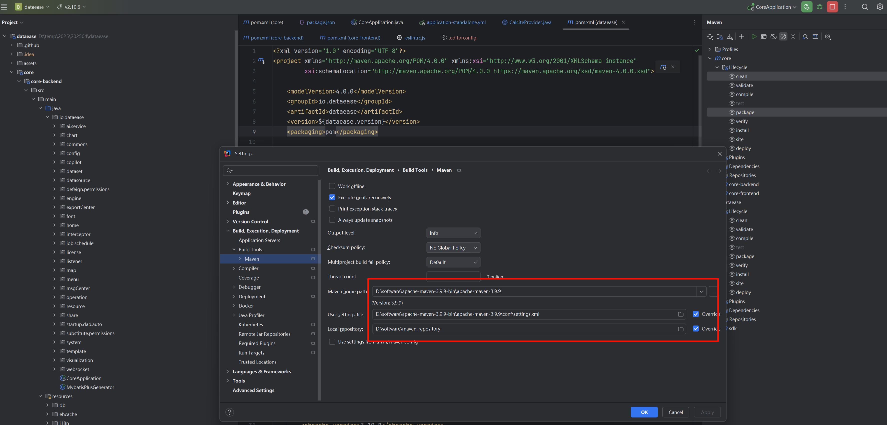

# 一、版本说明

当前版本是：


# 二、windows本地源码启动教程

## 2.0、环境准备

**开发环境说明：**
MySQL(>=5.7)
Apache Maven(>=3.8)
JDK(21)

## 2.1、下载Dataease

```bash
git clone https://github.com/dataease/dataease.git
```

## 2.2、IDEA中配置本地Maven

依次选择File -> Settings -> Build,Execution,Deployment -> Build Tools -> Maven




## 2.3、等待IDEA扫描完本地代码

略略略

## 2.4、手动添加core目录为pom


## 2.5、编译/打包dataease模块

选择IDEA右侧的Maven按钮，选择dataease -> package按钮进行打包，打包成功后点击install将各个子模块安装到本地Maven仓库中。


可以同时选择 `clean、package、install`

## 2.6、编译/打包core模块
### 2.6.0、指定环境
当第一次正常启动后，第二次再启动时，控制台报错一堆SQL错误时，该错误是由于在本地运行时，未指定执行环境，只需要指定即可：
编辑 application.yml 文件，将其中的 `active: '@profiles.active@'`，替换为：`active: standalone`

### 2.6.1、在后端项目中修改前端资源包打包配置

首次编译前，需要修改后端项目 `core-backend 目录中的 pom.xml` 文件，修改 `<filtering>true</filtering>` 中的值为 false ，避免编译时由前端向后端集成资源包时报错。


### 2.6.2、编译运行以及可能的问题

* 打开前端项目 `core-frontend` 目录中的pom.xml文件，在 pom.xml 中增加如下代码，会自动全局安装 win-node-env，用于解决 windows 系统出现‘`NODE_OPTIONS’ is not recognized as an internal or external command` 问题，让 Node.js 的环境变量可以在 Windows 环境下正常运行。


* 修改 core/core-frontend/.eslintrc.js 文件，在最后的 rules 节点中增加以下内容，避免前端项目在编译时因格式问题检查出现错误。


* 安装cross-env

> 防止可能出现的报错：`on project core-frontend: Failed to run task: 'npm run build:distributed' failed`，原因是：**Windows系统不支持NODE_OPTIONS命令**

```powershell
# 在目录下执行：
PS D:\temp\2025\202504\dataease> npm install cross-env --save-dev
# 这个目录下也执行下：
PS D:\temp\2025\202504\dataease\core\core-frontend> npm install cross-env --save-dev
```

同时在 `在core-frontend/package.json中添加cross-env命令`：


* 编辑 `core/core-frontend/package.json` 文件，添加依赖版本升级导致的报错，该报错解决方式来自：https://github.com/dataease/dataease/commit/0f6eeda31735b2ba00875fee2734081a217f845a


```json
 "overrides": {
        "@intlify/message-compiler": "9.14.2",
        "@intlify/shared": "9.14.2",
        "glob": {
            "inflight": "npm:inflight-lru@^1.0.0"
        }
    }
```


### 2.6.3、驱动配置

修改 `core/core-backend/src/main/java/io/dataease/datasource/provider/CalciteProvider.java` 文件：


```java
private final String FILE_PATH = System.getProperty("user.dir") + File.separator + "drivers";
private final String CUSTOM_PATH = System.getProperty("user.dir") + File.separator + "custom-drivers" + File.separator;
```

### 2.6.4、修改数据配置

因为默认使用的是 `src/main/resources/application-standalone.yml` 文件，因此编辑它：


### 2.6.5、创建数据库

```sql
CREATE DATABASE `dataease` DEFAULT CHARACTER SET utf8mb4 COLLATE utf8mb4_general_ci;
```

### 2.6.6、打包

选择IDEA右侧的Maven按钮，选择core -> package按钮进行打包（打包耗时较久，请耐心等待...）


## 2.7、启动运行


访问：

http://localhost:8100/


登录：`admin`

密码：`DataEase@123456`

> 补充：数据库表不用管，只需要手动创建库即可，在项目启动的过程中相关表会自动创建的。
>
> 


## 2.8 附maven配置

```xml
<?xml version="1.0" encoding="UTF-8"?>

<!--
Licensed to the Apache Software Foundation (ASF) under one
or more contributor license agreements.  See the NOTICE file
distributed with this work for additional information
regarding copyright ownership.  The ASF licenses this file
to you under the Apache License, Version 2.0 (the
"License"); you may not use this file except in compliance
with the License.  You may obtain a copy of the License at

    http://www.apache.org/licenses/LICENSE-2.0

Unless required by applicable law or agreed to in writing,
software distributed under the License is distributed on an
"AS IS" BASIS, WITHOUT WARRANTIES OR CONDITIONS OF ANY
KIND, either express or implied.  See the License for the
specific language governing permissions and limitations
under the License.
-->
<settings xmlns="http://maven.apache.org/SETTINGS/1.2.0"
          xmlns:xsi="http://www.w3.org/2001/XMLSchema-instance"
          xsi:schemaLocation="http://maven.apache.org/SETTINGS/1.2.0 https://maven.apache.org/xsd/settings-1.2.0.xsd">

    <localRepository>D:\software\maven-repository</localRepository>

    <pluginGroups>

    </pluginGroups>

    <proxies>

    </proxies>

    <servers>

    </servers>

    <mirrors>
        <!-- 阿里云镜像 -->
        <mirror>
            <id>aliyun</id>
            <mirrorOf>central</mirrorOf>
            <name>Aliyun Mirror</name>
            <url>https://maven.aliyun.com/repository/public</url>
        </mirror>


        <!-- 腾讯云镜像 -->

        <mirror>
            <id>tencent</id>
            <mirrorOf>central</mirrorOf>
            <name>Tencent Mirror</name>
            <url>https://mirrors.cloud.tencent.com/maven/</url>
        </mirror>


        <!-- 清华大学镜像 -->

        <mirror>
            <id>tuna</id>
            <mirrorOf>central</mirrorOf>
            <name>Tsinghua University Mirror</name>
            <url>https://mirrors.tuna.tsinghua.edu.cn/maven/</url>
        </mirror>


        <!-- 官方镜像，作为最后的fallback -->

        <mirror>
            <id>central</id>
            <mirrorOf>central</mirrorOf>
            <name>Central Mirror</name>
            <url>https://repo.maven.apache.org/maven2</url>
        </mirror>
    </mirrors>

    <profiles>

    </profiles>

    <!-- activeProfiles
     | List of profiles that are active for all builds.
     |
    <activeProfiles>
      <activeProfile>alwaysActiveProfile</activeProfile>
      <activeProfile>anotherAlwaysActiveProfile</activeProfile>
    </activeProfiles>
    -->
</settings>
```


> 相关内容参考自下面，在此一并表示感谢：
>
> * [[手把手教你搭建DataEase二次开发环境(Windows)](https://segmentfault.com/a/1190000045261128)](https://segmentfault.com/a/1190000045261128)
> * [本地前端打包部署报错，怀疑是不是Node版本问题](https://github.com/dataease/dataease/issues/15394)
> * [DataEase v2 开源代码 Windows 环境搭建](https://kb.fit2cloud.com/?p=b0c9abc1-2ec8-4301-acac-cff50b2a50be)
